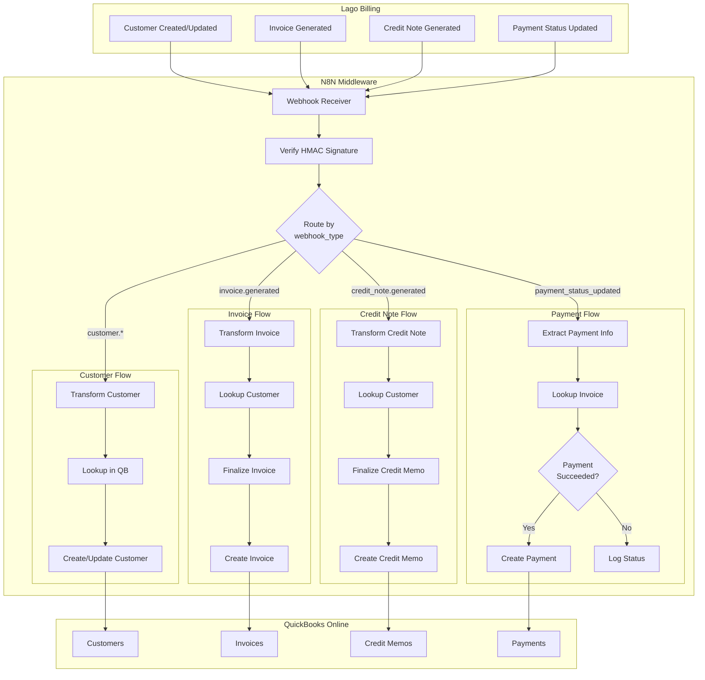
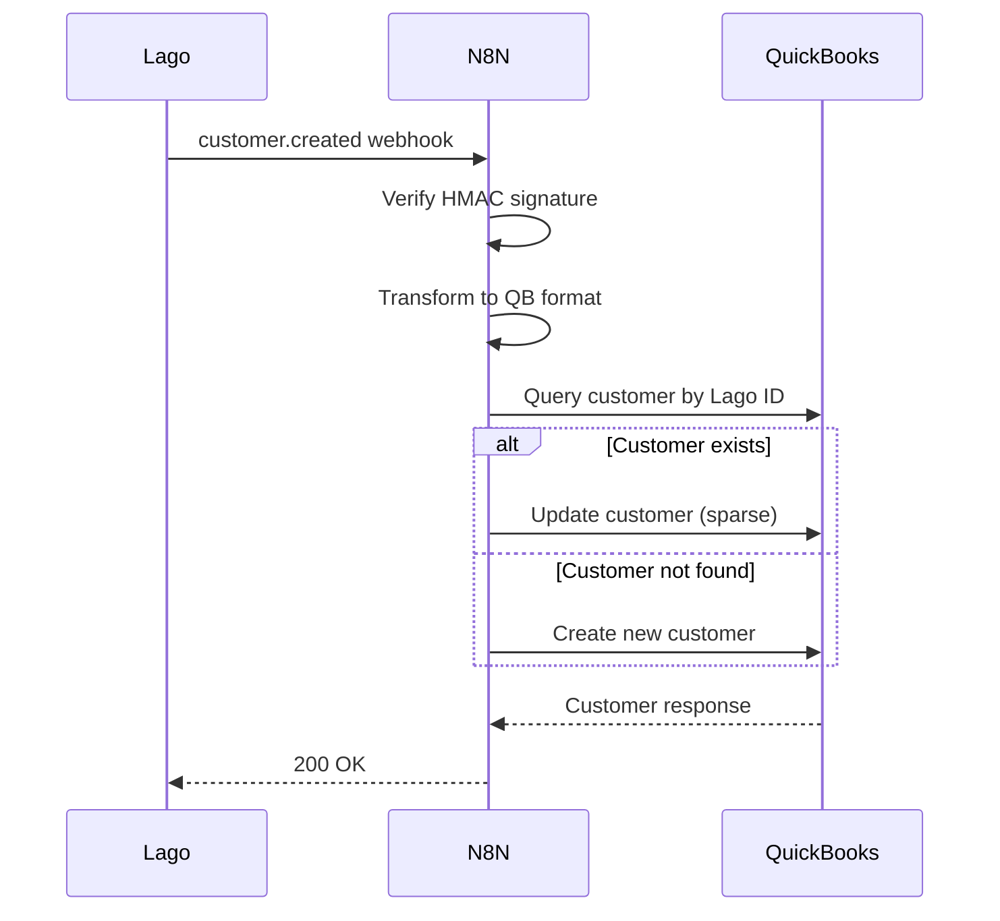
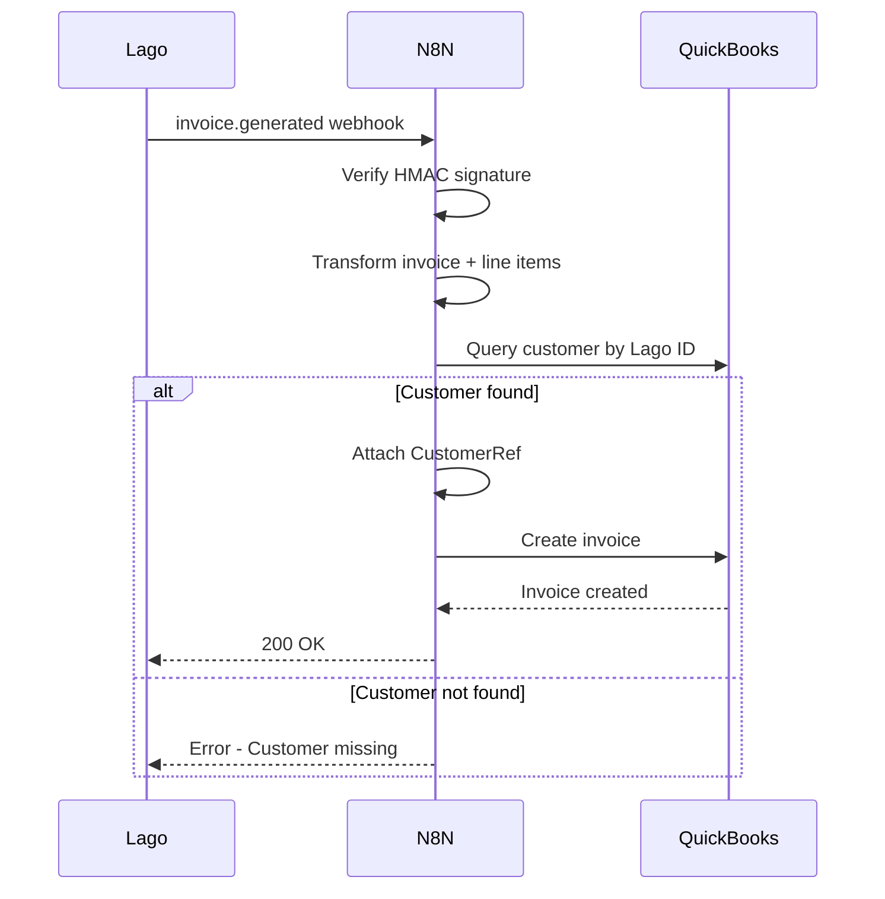
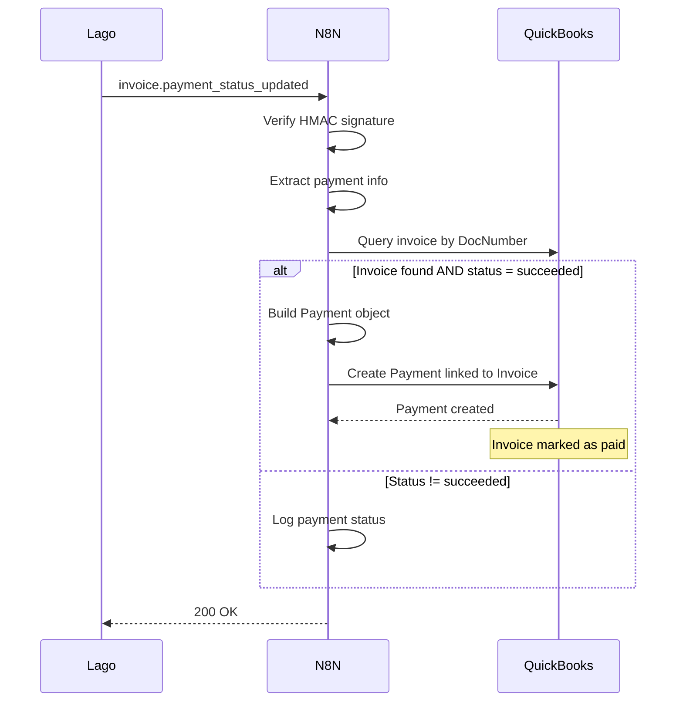
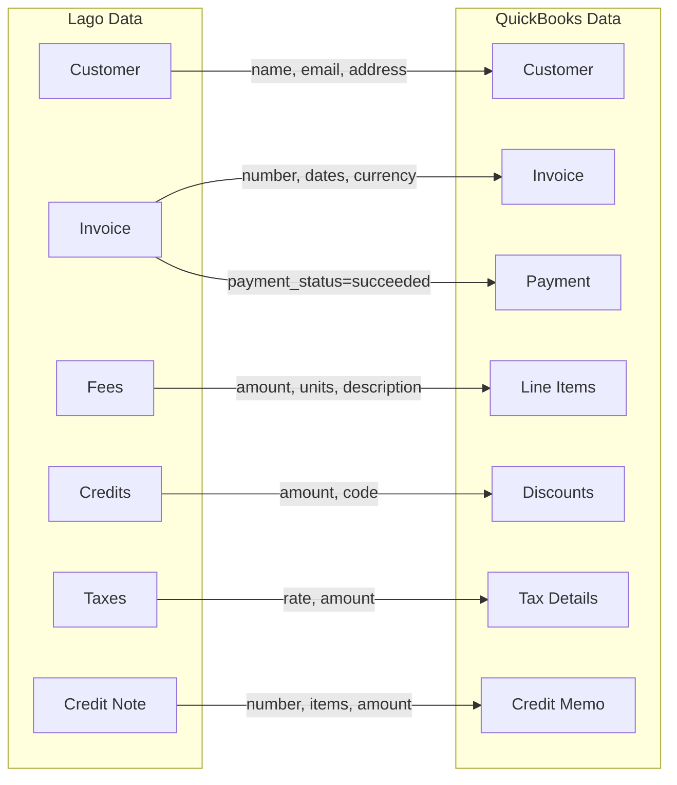

# Integration Flow Diagrams

## Main Webhook Processing Flow

```mermaid
flowchart TB
    subgraph Lago["Lago Billing"]
        L1[Customer Created/Updated]
        L2[Invoice Generated]
        L3[Credit Note Generated]
        L4[Payment Status Updated]
    end

    subgraph N8N["N8N Middleware"]
        WH[Webhook Receiver]
        SIG[Verify HMAC Signature]
        RT{Route by<br/>webhook_type}
        
        subgraph Customer["Customer Flow"]
            TC[Transform Customer]
            LC[Lookup in QB]
            UC[Create/Update Customer]
        end
        
        subgraph Invoice["Invoice Flow"]
            TI[Transform Invoice]
            LCI[Lookup Customer]
            FI[Finalize Invoice]
            CI[Create Invoice]
        end
        
        subgraph CreditNote["Credit Note Flow"]
            TCN[Transform Credit Note]
            LCCN[Lookup Customer]
            FCN[Finalize Credit Memo]
            CCN[Create Credit Memo]
        end
        
        subgraph Payment["Payment Flow"]
            EP[Extract Payment Info]
            LI[Lookup Invoice]
            PS{Payment<br/>Succeeded?}
            CP[Create Payment]
            LOG[Log Status]
        end
    end

    subgraph QuickBooks["QuickBooks Online"]
        QC[Customers]
        QI[Invoices]
        QCM[Credit Memos]
        QP[Payments]
    end

    L1 --> WH
    L2 --> WH
    L3 --> WH
    L4 --> WH
    
    WH --> SIG
    SIG --> RT
    
    RT -->|customer.*| TC
    RT -->|invoice.generated| TI
    RT -->|credit_note.generated| TCN
    RT -->|payment_status_updated| EP
    
    TC --> LC --> UC --> QC
    TI --> LCI --> FI --> CI --> QI
    TCN --> LCCN --> FCN --> CCN --> QCM
    EP --> LI --> PS
    PS -->|Yes| CP --> QP
    PS -->|No| LOG
```

## Customer Sync Flow

```mermaid
sequenceDiagram
    participant Lago
    participant N8N
    participant QB as QuickBooks

    Lago->>N8N: customer.created webhook
    N8N->>N8N: Verify HMAC signature
    N8N->>N8N: Transform to QB format
    N8N->>QB: Query customer by Lago ID
    
    alt Customer exists
        N8N->>QB: Update customer (sparse)
    else Customer not found
        N8N->>QB: Create new customer
    end
    
    QB-->>N8N: Customer response
    N8N-->>Lago: 200 OK
```

## Invoice Creation Flow

```mermaid
sequenceDiagram
    participant Lago
    participant N8N
    participant QB as QuickBooks

    Lago->>N8N: invoice.generated webhook
    N8N->>N8N: Verify HMAC signature
    N8N->>N8N: Transform invoice + line items
    N8N->>QB: Query customer by Lago ID
    
    alt Customer found
        N8N->>N8N: Attach CustomerRef
        N8N->>QB: Create invoice
        QB-->>N8N: Invoice created
        N8N-->>Lago: 200 OK
    else Customer not found
        N8N-->>Lago: Error - Customer missing
    end
```

## Payment Recording Flow

```mermaid
sequenceDiagram
    participant Lago
    participant N8N
    participant QB as QuickBooks

    Lago->>N8N: invoice.payment_status_updated
    N8N->>N8N: Verify HMAC signature
    N8N->>N8N: Extract payment info
    N8N->>QB: Query invoice by DocNumber
    
    alt Invoice found AND status = succeeded
        N8N->>N8N: Build Payment object
        N8N->>QB: Create Payment linked to Invoice
        QB-->>N8N: Payment created
        Note over QB: Invoice marked as paid
    else Status != succeeded
        N8N->>N8N: Log payment status
    end
    
    N8N-->>Lago: 200 OK
```

## Data Mapping Overview

```mermaid
graph LR
    subgraph Lago["Lago Data"]
        LC[Customer]
        LI[Invoice]
        LF[Fees]
        LCR[Credits]
        LT[Taxes]
        LCN[Credit Note]
    end

    subgraph QuickBooks["QuickBooks Data"]
        QC[Customer]
        QI[Invoice]
        QL[Line Items]
        QD[Discounts]
        QT[Tax Details]
        QCM[Credit Memo]
        QP[Payment]
    end

    LC -->|"name, email, address"| QC
    LI -->|"number, dates, currency"| QI
    LF -->|"amount, units, description"| QL
    LCR -->|"amount, code"| QD
    LT -->|"rate, amount"| QT
    LCN -->|"number, items, amount"| QCM
    LI -->|"payment_status=succeeded"| QP
```
